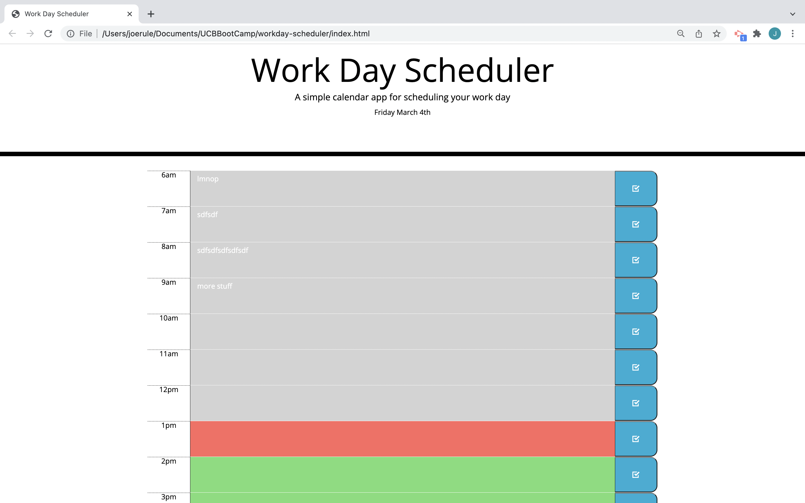

# workday-scheduler

A workday scheduler application that saves text entries and utilizes the javascript libraries jquery, bootstrap, and moment.

link to deployed app - https://josephrule.github.io/workday-scheduler/

screenshot

